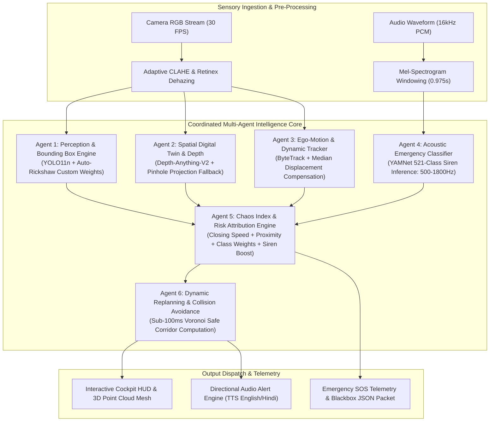
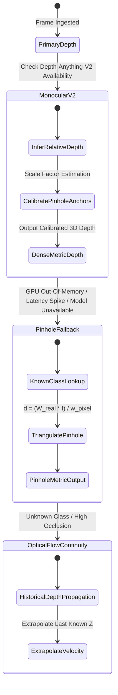

# AtmaNirbhar AI: Technical System Architecture

## 1. Executive Engineering Overview

**AtmaNirbhar AI** addresses the quintessential failure mode of conventional autonomous driving architectures: **the unstructured, non-Euclidean entropy of Indian roadways**. 

While Western autonomous platforms (e.g., Waymo Driver, Cruise Automation, Tesla FSD) rely heavily on high-definition LiDAR prior maps (HD Maps), structured lane markings, homogeneous vehicular behavior, and predictable traffic compliance, Indian roadways exhibit high stochastic entropy:
- **Absence of demarcated lanes**: Dynamic multi-lane formation where vehicles create virtual lanes based on available lateral clearance.
- **Extreme Vehicle Heterogeneity**: Co-presence of ultra-fast light commercial vehicles, three-wheeled auto-rickshaws, two-wheelers performing lateral filter overtakes, and heavy multi-axle freight carriers.
- **Unpredictable Biological Obstacles**: Roaming livestock (cattle, buffaloes, canines) exhibiting non-Newtonian deceleration and sudden heading changes.
- **Severe Road Topography Aberrations**: Unmarked speed bumps, deep asphalt potholes, waterlogged sections, and construction debris.
- **Acoustic Occlusion & Blind Intersections**: Emergency sirens masked by continuous ambient horn cacophony.

---

## 2. Ego-Motion Compensation Mathematics

When a dashboard camera traverses an unstructured roadway, every pixel in the optical frame exhibits apparent displacement due to camera motion:

$$\vec{v}_{\text{apparent}}(x,y) = \vec{v}_{\text{object}}(x,y) + \vec{v}_{\text{ego}}(x,y)$$

To differentiate genuinely dynamic obstacles from static background infrastructure (such as parked auto-rickshaws, curbs, or traffic cones), AtmaNirbhar AI applies an adaptive dual-mode ego-motion estimator:

### Mode A: Median Track Vector Estimation ($N \ge 3$)
For $N$ tracked features, the camera ego-displacement vector $\mathbf{d}_{\text{ego}} = [\Delta x_{\text{ego}}, \Delta y_{\text{ego}}]^T$ is estimated as:

$$\mathbf{d}_{\text{ego}} = \operatorname{median}_{i=1}^N \left( \mathbf{p}_i^{(t)} - \mathbf{p}_i^{(t-1)} \right)$$

where $\mathbf{p}_i = [c_x, c_y]^T$ represents the bounding box centroid. The object's true velocity $\mathbf{v}_{\text{true}}$ is obtained by subtracting the ego-shift:

$$\mathbf{v}_{\text{true}, i} = (\mathbf{p}_i^{(t)} - \mathbf{p}_i^{(t-1)}) - \mathbf{d}_{\text{ego}}$$

### Mode B: Dense Farneback Optical Flow Fallback ($N < 3$)
When fewer than 3 stable tracks exist, the system samples dense optical flow over lower-quadrant static road patches to compute instantaneous camera translation.

---

## 3. Sensor Redundancy & Graceful Degradation Architecture

---

## 4. Acoustic Siren Intelligence (YAMNet Integration)

Indian traffic is notoriously noisy, with continuous horns exceeding 90dB. Conventional sound-pressure thresholding yields catastrophic false positives.

AtmaNirbhar AI implements YAMNet (a deep Mobilenet-based acoustic feature extractor trained on AudioSet) listening across a **16,000 Hz single-channel PCM stream**:
- **Window Size**: 0.975 seconds with a 50% hop size.
- **Feature Representation**: 64-bin Mel spectrogram computed from STFT frames of 25ms length at 10ms hop.
- **Target Filter Classes**: `Siren`, `Emergency vehicle`, `Ambulance (siren)`, `Fire engine`, `Police car (siren)`.
- **Honest Telemetry Guarantee**: Distinguishes between `No audio track present` (e.g., silent dashcam video) versus `Audio track analyzed: No emergency sirens detected`.

---

## 5. Scene Chaos Index ($C \in [0, 100]$)

The Scene Chaos Index represents the instantaneous non-linear spatial entropy of the road environment:

$$C = \min\left(100, \; \sum_{i=1}^M \omega_i \cdot R_i + \lambda_{\text{var}} \sigma_{\vec{v}} + \beta_{\text{siren}} \mathbb{I}_{\text{siren}} \right)$$

Where:
- $R_i \in [0, 1]$ is the composite risk of obstacle $i$, computed from class hazard weight, inverse proximity $1/d_i$, and closing velocity $\dot{d}_i$.
- $\sigma_{\vec{v}}$ is the variance of obstacle motion vectors (high variance indicates chaotic crisscrossing pedestrian/rickshaw trajectories).
- $\mathbb{I}_{\text{siren}} \in \{0, 1\}$ is the acoustic siren indicator.
- $\beta_{\text{siren}} = 20.0$ introduces an immediate urgency elevation when an emergency vehicle is audible.
