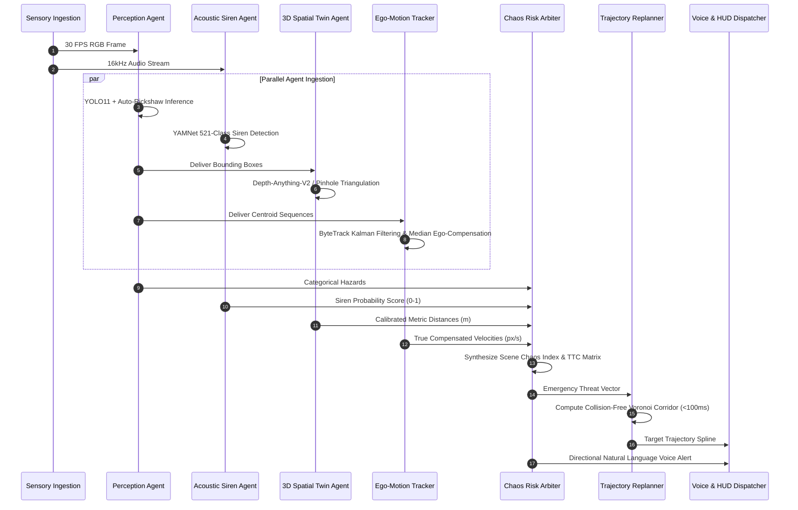

# Multi-Agent Coordination & Swarm Intelligence in AtmaNirbhar AI

## 1. Decentralized Multi-Agent Paradigm

Conventional autonomous driving systems implement monolithic pipelines where a single perception network feeds into a global planner. In the high-entropy environment of unstructured Indian roadways, monolithic architectures suffer from single-point failure modes:
1. When visual input degrades due to intense monsoonal spray, visual distance estimation collapses.
2. When multiple dynamic agents (pedestrians, cows, auto-rickshaws) cross paths non-orthogonally, monolithic trajectory predictors fail to converge.
3. Monolithic planners cannot arbitrate acoustic emergency signals (ambulance sirens) with visual geometry.

**AtmaNirbhar AI introduces a Coordinated Multi-Agent Intelligence Core** where distinct autonomous agents operate with decoupled execution budgets, isolated failure domains, and asynchronous consensus protocols.

---

## 2. Agent Specifications

### Agent 1: Multi-Modal Perception Agent
- **Charter**: High-precision boundary detection of 15+ Indian road classes.
- **Model Architecture**: Ultralytics YOLO11n fine-tuned on custom Indian vehicular datasets (auto-rickshaws, customized e-rickshaws, tempo carriers).
- **Execution Budget**: $\le 10\text{ ms}$ on CUDA edge compute.
- **Resilience Mechanism**: Contrast-limited adaptive histogram equalization (CLAHE) dynamically triggered when mean frame luminance $\bar{L} < 65$.

### Agent 2: Acoustic Siren Intelligence Agent
- **Charter**: Continuous acoustic emergency horizon surveillance.
- **Model Architecture**: YAMNet deep acoustic feature extractor operating on continuous 0.975-second audio buffers.
- **Target Emergency Classes**: 
  - Class 388: `Siren`
  - Class 389: `Emergency vehicle`
  - Class 390: `Police car (siren)`
  - Class 391: `Ambulance (siren)`
  - Class 392: `Fire engine`
- **Execution Budget**: $\le 5\text{ ms}$ per 0.5s audio chunk.
- **Consensus Behavior**: Injects emergency priority boost into the Chaos Index (+20 points) and triggers conversational voice yield alerts even when the emergency vehicle is completely occluded by preceding traffic.

### Agent 3: 3D Spatial Digital Twin Agent
- **Charter**: Accurate metric distance estimation and ground-plane spatial mapping without physical LiDAR hardware.
- **Hybrid Mechanics**:
  - Primary: Monocular relative disparity estimation via Depth-Anything-V2.
  - Secondary / Calibration: Known-class pinhole focal triangulation ($d = \frac{W_{\text{real}} \cdot f}{w_{\text{pixel}}}$).
- **Execution Budget**: $\le 18\text{ ms}$ on GPU, $<0.1\text{ ms}$ in pinhole fallback mode.

### Agent 4: Ego-Motion & Dynamic Motion Agent
- **Charter**: Decouple host vehicle velocity from true external obstacle displacement.
- **Algorithm**: ByteTrack multi-object association coupled with median displacement filtering.
- **Dynamic Threshold**: Compensated velocity magnitude $|\mathbf{v}_{\text{comp}}| > 3.0\text{ px/frame}$.

### Agent 5: Scene Chaos & Risk Attribution Agent
- **Charter**: Real-time non-linear threat aggregation and time-to-collision monitoring.
- **Mathematical Output**: Scene Chaos Score $C \in [0, 100]$ and per-obstacle threat levels (Low, Moderate, High, Critical).

### Agent 6: Dynamic Replanning & Voice AI Dispatcher
- **Charter**: Sub-100ms collision avoidance trajectory computation and conversational passenger guidance.
- **Actuation**: Generates Voronoi-based safe path corridors and natural synthetic voice alerts in English and Hindi.
