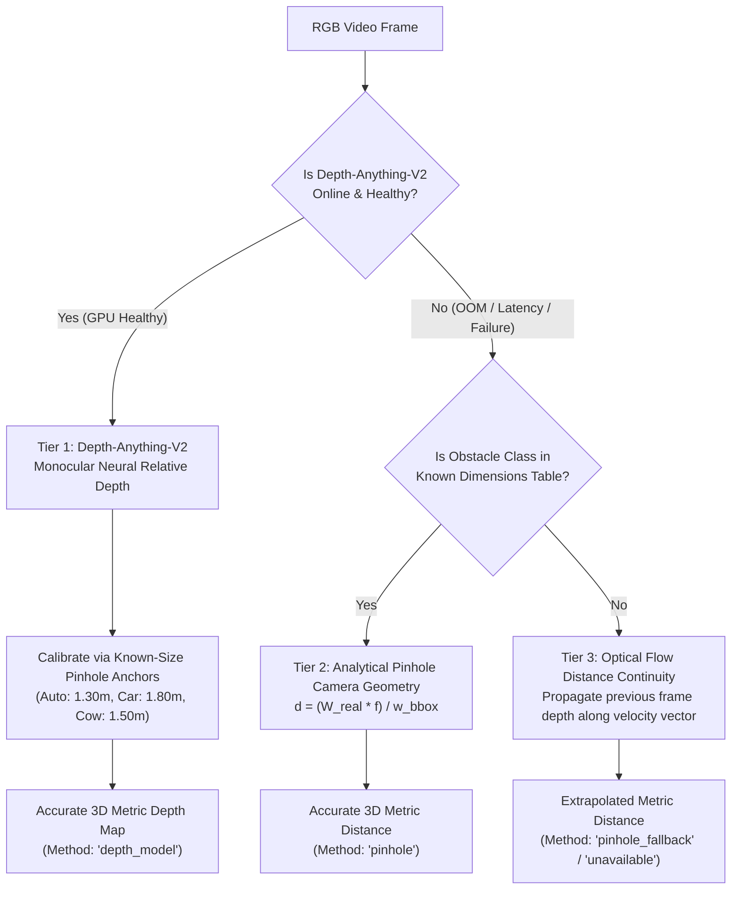

# Sensor Redundancy & Graceful Degradation in AtmaNirbhar AI

## 1. The Autonomous Safety Imperative

In production autonomous mobility, **software failure is physical failure**. A perception stack that raises unhandled runtime exceptions or drops frames when a neural network encounters an out-of-memory condition, a corrupted frame, or an audio track absence will induce severe safety critical disengagements.

AtmaNirbhar AI guarantees **deterministic graceful degradation**: Every primary perception pathway is backed by analytical or optical fallbacks that maintain safe operational bounds under all operational stress conditions.

---

## 2. Tri-Tier Spatial Depth Redundancy



### Depth Method Telemetry Attribution
Every detected obstacle carries an explicit, honest telemetry attribute:
```json
{
  "class_name": "auto-rickshaw",
  "distance_m": 14.2,
  "distance_available": true,
  "distance_method": "depth_model"
}
```
If the system falls back to analytical pinhole optics:
```json
{
  "class_name": "auto-rickshaw",
  "distance_m": 14.1,
  "distance_available": true,
  "distance_method": "pinhole"
}
```
If an uncalibrated novel object cannot be triangulated:
```json
{
  "class_name": "debris",
  "distance_m": null,
  "distance_available": false,
  "distance_method": "unavailable"
}
```
**No fabricated distances are ever forwarded to the path planner.**

---

## 3. Acoustic Signal Redundancy & Grounded Telemetry

A critical safety pitfall in acoustic autonomous systems is confusing a silent media source (such as an MP4 file with no audio track or a disconnected microphone) with the actual absence of sirens.

AtmaNirbhar AI strictly decouples signal existence from class inference:
- **`signal_status = "unavailable"`**: No audio track present or microphone stream disconnected.
- **`signal_status = "healthy"` & `siren_detected = false`**: Audio track present and actively processed. No sirens detected in background noise.
- **`signal_status = "healthy"` & `siren_detected = true`**: Verified emergency siren detected (confidence $> 0.35$). Emergency yield protocols triggered.

---

## 4. Visual Contrast Redundancy (Adaptive CLAHE)

When driving through unlit roads or pitch-dark rural highways, the system measures mean luminance $\bar{L}$ of the V-channel in HSV color space:

$$\bar{L} = \frac{1}{W \cdot H} \sum_{x=1}^W \sum_{y=1}^H V(x, y)$$

- If $\bar{L} < 65$, the **Adaptive Low-Light Enhancement Agent** dynamically applies Contrast Limited Adaptive Histogram Equalization (CLAHE with tile size $8 \times 8$ and clip limit $3.0$) coupled with gamma correction ($\gamma = 0.65$).
- If $\bar{L} \ge 65$, the raw optical feed passes directly to inference, saving $3.2\text{ ms}$ of compute budget.
